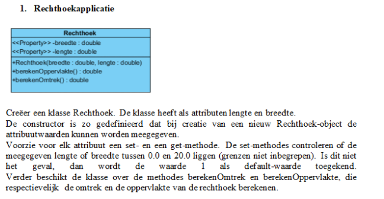
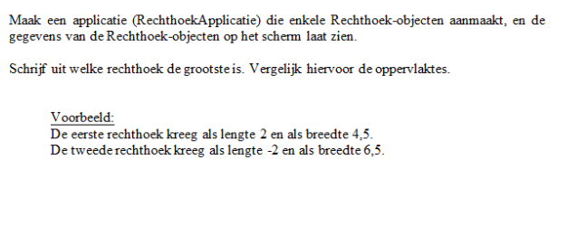

1. Clone repository "Teachinghelo" met gitkraken, sla je lokale clone op in Documenten/Github/TEACHINGHELO
2. Open Eclipse kies als workspace de map TeachingHelo

3. Start een nieuw project en werk de oef uit

OEFENING
 
PACKAGE DOMEIN:
 

 
PACKAGE UI
 

 
OUTPUT APP
 

ALS JE KLAAR BENT SLA JE ALLES OP IN ECLIPSE
DAARNA OPEN JE GITKRAKEN SELECTEER JE DE FILES DIE JE WILT STAGEN, MESSAGE ERBIJ DAARNA PUSH (als je niet goed weet hoe dat werkt stuur me dan ik zal helpen)